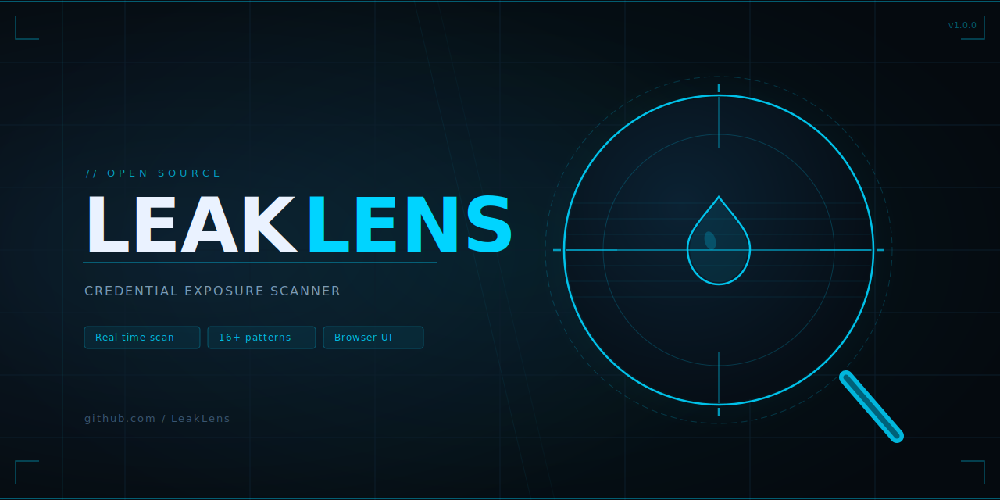
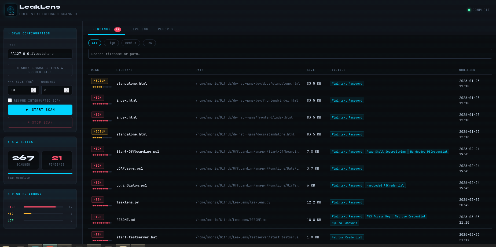

# LeakLens



**LeakLens** is a local web-based credential exposure scanner. It scans file shares for files likely to contain passwords, password hashes, private keys, or other sensitive credential data — and streams results to a browser UI in real time.

Born from a pentest finding. Built to make sure it doesn't happen again.

**Scan.Detect.Secure.**
Find Exposed Secrets Before Attackers Do LeakLens scans your internal file shares to detect passwords, hashes, API keys, and sensitive identifiers
---

## Requirements

- [Node.js](https://nodejs.org) v16 or higher
- PowerShell — built-in on Windows; install [`pwsh`](https://github.com/PowerShell/PowerShell) on Linux/macOS

---

## Quick Start

**Windows**
```
start.bat
```

**Linux / macOS**
```bash
chmod +x start.sh && ./start.sh
```

Dependencies install automatically on first run. The browser opens at `http://localhost:3000`.

---

## Usage

1. Enter a file share path — UNC (`\\server\share`) or local (`D:\data`)
2. Set the maximum file size to scan (default: 10 MB)
3. Click **Start Scan**
4. Findings stream into the browser in real time as the scanner progresses
5. Click any finding to open a detail panel with context and a remediation recommendation

---

## What It Detects

**Content patterns** (text files are scanned for):

| Pattern | Description |
|---|---|
| Plaintext Password | `password=`, `passwd=`, `pwd=` assignments |
| Connection String | Embedded passwords in connection strings |
| NTLM / LM Hash | `hash:hash` pairs |
| MD5 / SHA1 / SHA256 / SHA512 | Hash strings by length |
| Bcrypt Hash | `$2a$`, `$2b$`, `$2y$` prefixed hashes |
| Base64 Credential | Base64-encoded values next to credential keywords |
| AWS Access Key | `AKIA…` key patterns |
| API Key / Bearer Token | Generic token and API key assignments |
| Private Key Header | `-----BEGIN … PRIVATE KEY-----` |
| PowerShell PSCredential | Hardcoded `PSCredential` objects |
| Net Use Credential | `net use /user:` commands |
| SQL sa Password | SQL `sa` / `sysadmin` password assignments |

**Flagged by file type** (no content scan needed):
`.kdbx`, `.kdb`, `.pfx`, `.p12`, `.ppk`, `.pem`, `.key`, `.jks`, `.wallet`

**Flagged by filename**: files whose name contains `password`, `creds`, `secret`, `token`, `id_rsa`, `apikey`, and similar terms.

**Scanned file types**: `.ps1`, `.psm1`, `.bat`, `.cmd`, `.sh`, `.txt`, `.log`, `.xml`, `.config`, `.json`, `.yaml`, `.ini`, `.env`, `.csv`, `.sql`, `.py`, `.rb`, `.php`, `.htm`, `.html`, `.md`

---

## Risk Levels

| Level | Criteria |
|---|---|
| 🔴 HIGH | Private key, NTLM hash, plaintext password, or sensitive binary file type |
| 🟡 MEDIUM | 2+ patterns matched, or suspicious filename |
| 🟢 LOW | 1 pattern matched |

---



---

## Test Server

A Samba container pre-loaded with intentionally unsafe files is included for testing LeakLens without touching real infrastructure. Requires Docker or Podman.

**Windows**
```
testserver\start-testserver.bat
```

**Linux / macOS**
```bash
./testserver/start-testserver.sh
```

Runs on port **4445** to avoid conflict with the Windows SMB service. After starting, mount the share and point LeakLens at it:

```cmd
# Windows — mount then scan Z:\
net use Z: \\127.0.0.1\testshare /user:guest "" /p:no /port:4445
```

```bash
# Linux — mount then scan /mnt/testshare
sudo mount -t cifs //127.0.0.1/testshare /mnt/testshare -o port=4445,guest,vers=2.0
```

See `testserver/README.md` for the full list of test files and what each one triggers.

---

## Project Structure

```
LeakLens/
├── start.bat              # Windows launcher
├── start.sh               # Linux/macOS launcher
├── Images/                # Holds images for readme
├── reports/               # JSON scan reports (auto-created)
├── backend/
│   ├── server.js          # Express API + SSE streaming
│   ├── scanner.ps1        # PowerShell scanner core
│   └── package.json
├── frontend/
│   └── index.html         # Browser UI
│   └── Assets/            # Holds the icon for the browser
└── testserver/
    ├── Dockerfile
    ├── smb.conf
    ├── start-testserver.bat   ← Windows start
    ├── stop-testserver.bat    ← Windows stop
    ├── start-testserver.sh    ← Linux/macOS start
    ├── stop-testserver.sh     ← Linux/macOS stop
    ├── README.md
    └── dirty-files/
        ├── deploy.ps1          → PSCredential, plaintext password, connection string
        ├── app.config          → plaintext password, API key, bearer token
        ├── passwords.txt       → NTLM hashes, plaintext passwords
        ├── .env                → AWS key, plaintext passwords
        ├── nightly-backup.bat  → net use credential
        ├── db_maintenance.py   → plaintext password, bearer token
        ├── id_rsa              → private key header
        └── project-notes.md    → clean file (no findings expected)
```

---

## How It Works

The Node.js backend spawns the PowerShell scanner as a subprocess. The scanner outputs findings as newline-delimited JSON (NDJSON) to stdout. The backend forwards these to the browser via **Server-Sent Events (SSE)**, giving near real-time feedback without polling. Each completed scan is saved as a timestamped JSON report in `/reports`.

---

## Legal

Run LeakLens only on systems and file shares you are authorized to access. Scanning reads file contents — ensure you have the appropriate permissions before use.
