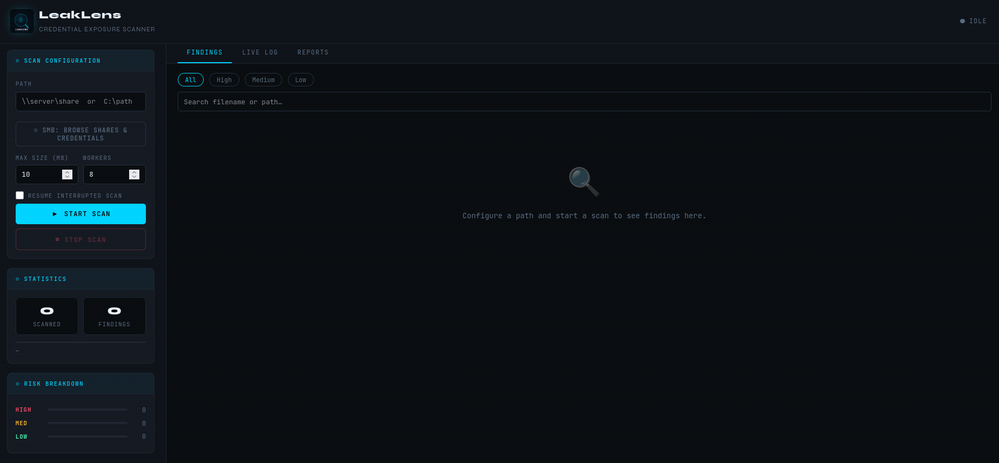
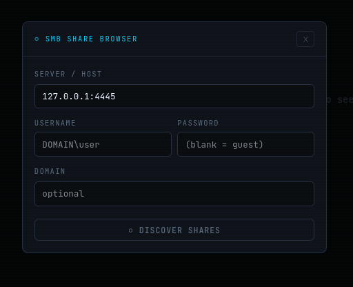
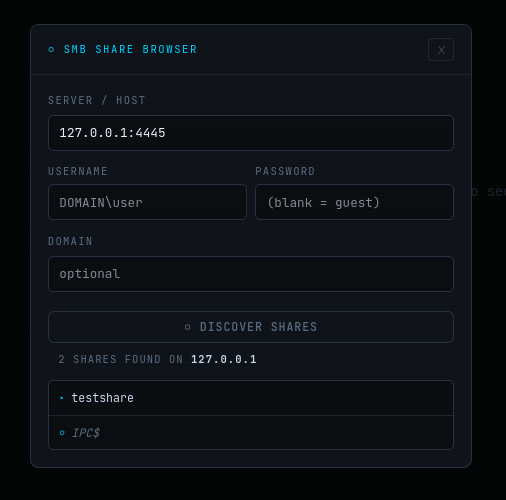
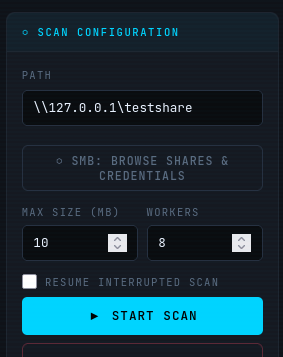
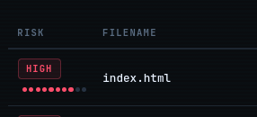
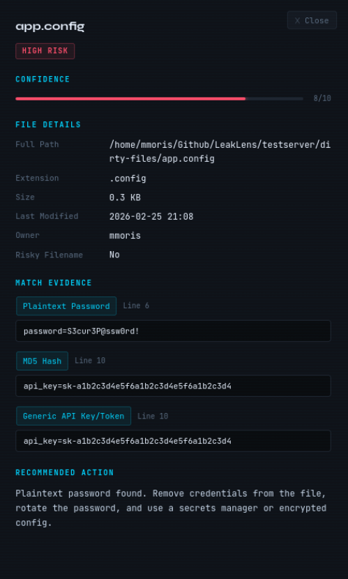
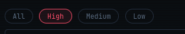
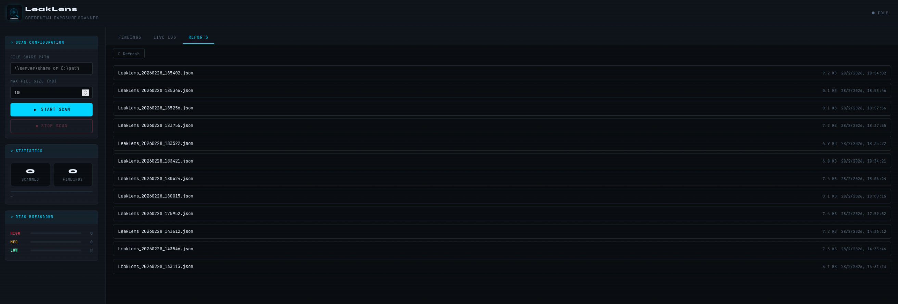
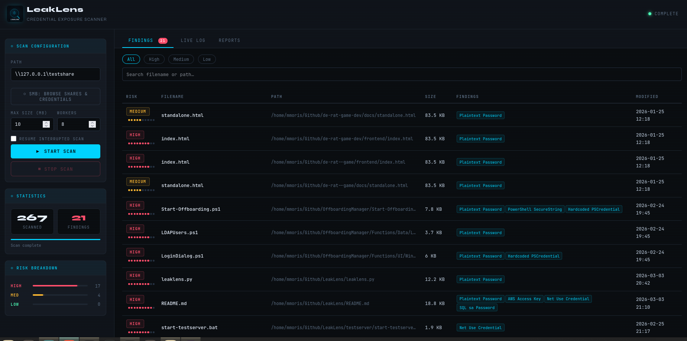
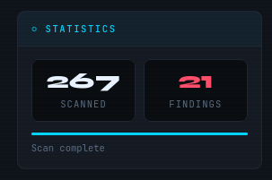

# LeakLens — User Guide & Walkthrough

This guide walks through every major feature of LeakLens from first launch to advanced usage.
For a quick overview and API reference see [README.md](README.md).

---

## Table of Contents

1. [Installation](#1-installation)
2. [First Launch](#2-first-launch)
3. [Scanning a Local Path](#3-scanning-a-local-path)
4. [Scanning an SMB Share](#4-scanning-an-smb-share)
   - [Browse and select a share](#41-browse-and-select-a-share-recommended)
   - [Guest / anonymous access](#42-guestanonymous-access)
   - [Authenticated access](#43-authenticated-access)
   - [Non-standard ports](#44-non-standard-ports)
5. [Understanding Your Results](#5-understanding-your-results)
   - [Risk levels and confidence scores](#51-risk-levels-and-confidence-scores)
   - [The detail drawer](#52-the-detail-drawer)
   - [Filtering and searching](#53-filtering-and-searching)
6. [Working with Reports](#6-working-with-reports)
7. [Resuming Interrupted Scans](#7-resuming-interrupted-scans)
8. [Test Server Walkthrough](#8-test-server-walkthrough)
9. [Advanced Features](#9-advanced-features)
   - [Tuning worker threads](#91-tuning-worker-threads)
   - [Custom detection patterns](#92-custom-detection-patterns)
   - [Suppressing false positives](#93-suppressing-false-positives-leaklensignore)
   - [Webhooks and notifications](#94-webhooks-and-notifications)
   - [CLI usage](#95-cli-usage)
10. [Running the Automated Tests](#10-running-the-automated-tests)

---

## 1. Installation

```bash
# Clone the repository
git clone https://github.com/CreativeAcer/LeakLens.git
cd LeakLens

# (Recommended) create an isolated virtual environment
python3 -m venv .venv
source .venv/bin/activate          # Windows: .venv\Scripts\activate

# Install runtime dependencies
pip install -r requirements.txt
```

**SMB share enumeration** requires the Samba `smbclient` binary on Linux/macOS (used for the Discover Shares feature):

```bash
sudo apt install smbclient       # Debian / Ubuntu
sudo dnf install samba-client    # Fedora / RHEL
brew install samba               # macOS
```

---

## 2. First Launch

**Windows**
```
start.bat
```

**Linux / macOS**
```bash
chmod +x start.sh && ./start.sh
```

Or directly:
```bash
python3 leaklens.py
```

Open **http://localhost:3000** in your browser.


*Main UI on first load — the status indicator shows Idle, the findings area shows the empty state prompt.*

> **Binding to other interfaces:** The server defaults to `127.0.0.1:3000`.
> Override with environment variables: `LEAKLENS_HOST=0.0.0.0 LEAKLENS_PORT=8080 python3 leaklens.py`
> Only expose LeakLens on a network interface if you are on a trusted network — it has no authentication.

---

## 3. Scanning a Local Path

1. Type a local path into the **Path** field — e.g. `C:\FileShares` on Windows or `/srv/files` on Linux
2. Set **Max Size (MB)** — files larger than this are skipped entirely (default 10 MB)
3. Set **Workers** — number of parallel analysis threads (default 8; see [§9.1](#91-tuning-worker-threads))
4. Click **▶ Start Scan**


*A local scan in progress — the progress bar shows the files/second rate and the findings table populates in real time.*

Findings appear as they are discovered. The status dot in the header turns green during scanning and returns to grey when complete. Click **■ Stop Scan** at any time to interrupt — the checkpoint is preserved so you can resume later (see [§7](#7-resuming-interrupted-scans)).

---

## 4. Scanning an SMB Share

LeakLens connects to SMB shares directly over the network — no `net use`, no mounting, no admin rights required.

### 4.1 Browse and select a share (recommended)

1. Click **⬡ SMB: Browse Shares & Credentials** in the Scan Configuration panel


*The SMB Share Browser modal — enter a server address to begin.*

2. Type a server address into **Server / Host** — for example `192.168.1.10` or `fileserver01`
3. Optionally fill in credentials (see [§4.2](#42-guestanonymous-access) and [§4.3](#43-authenticated-access))
4. Click **⬡ Discover Shares**


*Shares returned by the server. User shares appear with a folder icon; administrative shares (IPC$, ADMIN$, C$) are grouped and labelled separately.*

5. Click any share row — the **Path** field is populated automatically and the modal closes after a short delay


*The Path field filled with the UNC path of the selected share, ready to scan.*

6. Click **▶ Start Scan**

---

### 4.2 Guest / anonymous access

Leave **Username** and **Password** blank in the modal. LeakLens sends a null session which the Samba server maps to the guest account when the share allows it.

Most open internal file shares (and the included test server) work this way with no configuration needed.

---

### 4.3 Authenticated access

Fill in credentials before clicking Discover Shares:

| Field | Example |
|---|---|
| Username | `DOMAIN\jsmith` or just `jsmith` |
| Password | the account password |
| Domain | `CORP` (optional — include for NTLM domain authentication) |

Credentials flow only to the LeakLens backend running locally and are never written to disk.

---

### 4.4 Non-standard ports

Append `:port` to the host when the server is not on the standard SMB port 445:

```
192.168.1.10:4445
fileserver01:4450
```

The port is parsed automatically and applied to both share enumeration and the subsequent file scan — no other configuration is needed.

---

## 5. Understanding Your Results

### 5.1 Risk levels and confidence scores

Every finding is scored 1–10 based on how certain the match is, then grouped into three risk levels:

| Level | Score | What it typically means |
|---|---|---|
| 🔴 HIGH | 8–10 | Near-certain credential — private key, plaintext password, AWS key, NTLM hash |
| 🟡 MEDIUM | 5–7 | Probable credential — API key pattern, PSCredential, suspicious filename |
| 🟢 LOW | 1–4 | Low signal — generic hash strings, very broad patterns |

The **Risk Breakdown** panel in the sidebar tracks live counts and proportional bars for each level as the scan progresses.


*Risk Breakdown panel mid-scan — HIGH and MEDIUM findings already visible while the scan is still running.*

Two automatic confidence reductions apply:

- **Docs / examples paths** — files found inside directories named `docs`, `examples`, `test`, `sample`, or similar have their confidence reduced by 3 points
- **Hash-only findings** — if a file matches only generic hash patterns (MD5, SHA1, etc.) it is demoted to LOW with the note: *"Hash strings detected — verify these are credential hashes and not integrity checksums."*

---

### 5.2 The detail drawer

Click any row in the findings table to open the detail drawer.


*Detail drawer showing the matched pattern, line number, exact matched line, file metadata, and remediation advice.*

The drawer shows:

- **Pattern name and confidence score** for each pattern matched in this file
- **Line number and exact matched line** — confirm findings without opening the file
- **File metadata** — size, last modified, last accessed
- **SMB context** (UNC paths only) — server, share name, and relative path within the share
- **Remediation advice** — specific to the match type and referencing the exact share or path

Lines are truncated at 120 characters. Findings triggered by file type (`.pfx`, `.kdbx`, etc.) or filename (`id_rsa`, `.env`) show an explanatory note in place of a snippet.

---

### 5.3 Filtering and searching

Use the toolbar above the findings table to narrow results:

- **All / High / Medium / Low** — filter by risk level
- **Search box** — substring filter on filename or full path (case-insensitive, updates live)


*Findings table filtered to HIGH risk only with a path search active — the badge on the Findings tab still shows the total unfiltered count.*

---

## 6. Working with Reports

Every completed scan is saved automatically to the `reports/` directory:

- **SQLite database** — `LeakLens_<timestamp>.db` — primary store, supports fast paginated queries
- **JSON report** — `LeakLens_<timestamp>.json` — human-readable, portable

Open the **Reports** tab to see all saved scans.


*Reports tab showing completed scans listed by timestamp with their total finding counts.*

Click any report to reload its findings into the main view with full filtering, search, and drawer support. The SQLite backend means even scans with tens of thousands of findings load quickly through server-side pagination.

**SARIF export** — reload a report into any SAST dashboard (GitHub Advanced Security, Azure DevOps) via the SARIF 2.1.0 endpoint:

```
GET /api/reports/LeakLens_20240101_120000.json?format=sarif
```

---

## 7. Resuming Interrupted Scans

If a scan is stopped or crashes, LeakLens saves a checkpoint in `reports/`. The checkpoint records which files were already processed.

To resume:

1. Set the **Path** to the same root as the previous scan
2. Check **Resume interrupted scan**
3. Click **▶ Start Scan**

Already-processed files are skipped and the scan continues from the last checkpoint. All prior findings are preserved in the SQLite database and visible immediately.

> Checkpoints are keyed to the scan root path. Changing the path always starts a fresh scan.

---

## 8. Test Server Walkthrough

A Samba container pre-loaded with 8 intentionally dirty files is included. Use it to verify LeakLens is working correctly without touching real infrastructure.

**Requirements:** Docker or Podman. The start scripts detect whichever is available automatically.

### Start the container

```bash
# Linux / macOS
./testserver/start-testserver.sh

# Windows
testserver\start-testserver.bat
```

The container starts Samba on port **4445**. You should see:

```
[OK] Using docker
[*] Building test server image...
[OK] Image built
[*] Starting test file server...
Test server running on port 4445!
```

### Connect LeakLens to the test server

1. Click **⬡ SMB: Browse Shares & Credentials** in the Scan Configuration panel
2. Enter `127.0.0.1:4445` in **Server / Host**
3. Leave Username and Password blank (the share allows guest access)
4. Click **⬡ Discover Shares**


*Discover Shares result against the test server — testshare appears in the list.*

5. Click **testshare** — the Path field fills with `\\127.0.0.1\testshare`
6. Click **▶ Start Scan**

### Expected findings

All credentials in the test files are completely fake and exist only to trigger detection.

| File | Expected patterns |
|---|---|
| `deploy.ps1` | Plaintext Password, Connection String, PowerShell SecureString, Hardcoded PSCredential |
| `app.config` | Plaintext Password, Generic API Key/Token |
| `passwords.txt` | NTLM Hash |
| `.env` | AWS Access Key, Plaintext Password, Base64 Credential, Stripe API Key |
| `nightly-backup.bat` | Net Use Credential |
| `db_maintenance.py` | Plaintext Password, Bearer Token |
| `id_rsa` | Private Key Header |
| `project-notes.md` | *(clean — no findings expected)* |


*Completed scan against the test server — 8 files scanned, findings across HIGH and MEDIUM risk levels.*

### Stop the container

```bash
./testserver/stop-testserver.sh   # Linux / macOS
testserver\stop-testserver.bat    # Windows
```

The container is stateless — stopping it removes all data. Restart it any time with the start script.

---

## 9. Advanced Features

### 9.1 Tuning worker threads

The **Workers** input (1–16, default 8) controls how many files are analysed in parallel.

| Scenario | Recommended |
|---|---|
| Local fast SSD | 12–16 |
| Local HDD | 6–8 |
| SMB over gigabit LAN | 8–12 |
| SMB over slow WAN / VPN | 4–6 |
| Very large shares (>100 k files) | 8 (avoid queue saturation) |

The live files/second rate in the progress bar is the best guide — increase workers until the rate plateaus. That plateau is the I/O ceiling of the target.

---

### 9.2 Custom detection patterns

Add your own patterns without modifying source code. Create a YAML file:

```yaml
- id: my_internal_token
  name: "Internal API Token"
  regex: 'INT-[A-Z0-9]{32}'
  confidence: 9
  description: "Internal service token format"
```

**Via the UI** — enter the path to your YAML file in the **Custom Patterns File** input in the Scan Configuration panel.

**Via the CLI:**
```bash
python3 leaklens.py scan --path \\server\share --patterns my-patterns.yaml
```

**Via the API:**
```json
POST /api/scan
{ "scanPath": "\\\\server\\share", "patternsFile": "/path/to/my-patterns.yaml" }
```

Required fields per pattern: `id`, `name`, `regex`, `confidence` (1–10). Optional: `description`.

---

### 9.3 Suppressing false positives (`.leaklensignore`)

Drop a `.leaklensignore` file in the scan root to silence known-safe paths. The format mirrors `.gitignore` with an optional `[pattern_id]` section syntax for per-pattern suppression:

```
# Suppress all findings under these paths
archive/**
legacy/**
*.example.config

# Suppress the md5_hash pattern only inside checksum directories
[md5_hash]
checksums/**
*.md5

# Suppress aws_access_key matches only in documentation
[aws_access_key]
docs/**
```

The `[pattern_id]` syntax lets you silence a noisy pattern in known-safe locations while keeping it active everywhere else.

**Pattern ID reference:**

| ID | Pattern name |
|---|---|
| `plaintext_password` | Plaintext Password |
| `connection_string` | Connection String |
| `ntlm_hash` | NTLM Hash |
| `bcrypt_hash` | Bcrypt Hash |
| `base64_credential` | Base64 Credential |
| `aws_access_key` | AWS Access Key |
| `github_pat` | GitHub Personal Access Token |
| `gitlab_pat` | GitLab Personal Access Token |
| `stripe_key` | Stripe API Key |
| `slack_token` | Slack Token |
| `sendgrid_key` | SendGrid API Key |
| `azure_client_secret` | Azure Client Secret |
| `azure_storage_key` | Azure Storage Account Key |
| `dpapi_blob` | DPAPI Encrypted Blob |
| `generic_api_key` | Generic API Key/Token |
| `bearer_token_value` | Bearer Token |
| `private_key_header` | Private Key Header |
| `net_use_credential` | Net Use Credential |
| `ps_secure_string` | PowerShell SecureString |
| `hardcoded_pscredential` | Hardcoded PSCredential |
| `sql_sa_password` | SQL sa Password |
| `md5_hash` | MD5 Hash |
| `sha1_hash` | SHA1 Hash |
| `sha256_hash` | SHA256 Hash |
| `sha512_hash` | SHA512 Hash |

The full list with regex and confidence values is in `scanner/patterns.py`.

---

### 9.4 Webhooks and notifications

LeakLens can POST a JSON summary to a webhook URL when a scan completes.

**Via the UI** — open the **Notifications** panel (click the header to expand), enter your **Webhook URL** and optionally a **Webhook Secret** for HMAC-SHA256 request signing.


*Expanded Notifications panel with a webhook URL and secret entered.*

**Via the CLI:**
```bash
python3 leaklens.py scan \
  --path \\server\share \
  --webhook-url https://hooks.example.com/leaklens \
  --webhook-secret mysecret
```

The payload includes the scan summary: total files scanned, finding counts by risk level, scan ID, and timestamp. When a secret is set, a `X-LeakLens-Signature` header carrying the HMAC-SHA256 digest lets your endpoint verify the request origin.

---

### 9.5 CLI usage

LeakLens can run entirely headless without the browser UI:

```bash
python3 leaklens.py scan \
  --path "\\\\fileserver01\\IT" \
  --output report.json \
  --format json \
  --workers 8 \
  --max-size 20 \
  --patterns custom.yaml \
  --resume
```

**SMB with credentials and non-standard port:**
```bash
python3 leaklens.py scan \
  --path "\\\\192.168.1.10\\share" \
  --smb-port 4445 \
  --username "DOMAIN\jsmith" \
  --password "hunter2" \
  --domain CORP
```

**SARIF output for CI pipelines:**
```bash
python3 leaklens.py scan \
  --path /srv/files \
  --output results.sarif \
  --format sarif
```

**All flags:**

| Flag | Default | Description |
|---|---|---|
| `--path` | — | Path to scan (required) |
| `--output` | stdout | Output file |
| `--format` | `json` | `json` or `sarif` |
| `--workers` | `8` | Parallel worker threads (1–16) |
| `--max-size` | `10` | Max file size in MB |
| `--patterns` | — | Path to custom patterns YAML |
| `--resume` | false | Resume from checkpoint |
| `--smb-port` | `445` | SMB port |
| `--username` | — | SMB username |
| `--password` | — | SMB password |
| `--domain` | — | SMB domain |
| `--webhook-url` | — | POST summary here on completion |
| `--webhook-secret` | — | HMAC-SHA256 signing secret |

---

## 10. Running the Automated Tests

Install dev dependencies, then run pytest:

```bash
pip install -r requirements-dev.txt
python -m pytest tests/ -v
```

Expected output ends with all tests passing:

```
======================== 170 passed in X.Xs ==============================
```

**Run individual modules:**

```bash
python -m pytest tests/test_patterns.py -v   # regex positive/negative tests
python -m pytest tests/test_engine.py -v     # scan_content, build_finding, suppression
python -m pytest tests/test_api.py -v        # Flask endpoint tests
python -m pytest tests/test_smb.py -v        # mocked SMB helpers
python -m pytest tests/test_sarif.py -v      # SARIF structure and mapping
```

**What each module covers:**

| Module | Scope |
|---|---|
| `test_patterns.py` | Every pattern has at least one positive and one negative string; structural checks (compile, risk/confidence consistency, required keys); custom pattern loading from YAML |
| `test_engine.py` | `scan_content()` detects known patterns; confidence reduction in docs paths; `build_finding()` dict shape; `is_placeholder_match()` and `is_docs_path()` |
| `test_api.py` | All endpoints: correct status codes, path traversal blocked on `/api/reports/<name>`, `scan_id` injection rejected, invalid host/port/page rejected |
| `test_smb.py` | `register_session`, `walk_smb`, `read_smb_file`, `list_shares` — all mocked, no live server needed |
| `test_sarif.py` | SARIF 2.1.0 structure, one result per match, rules deduped, correct severity mapping |
